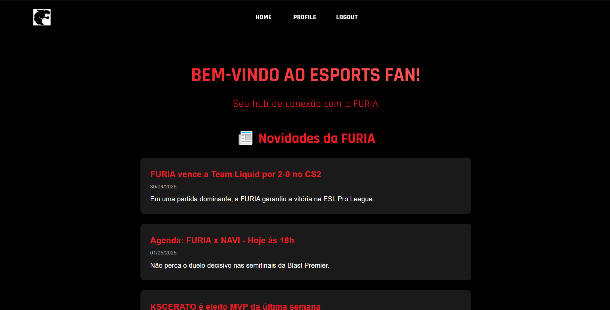
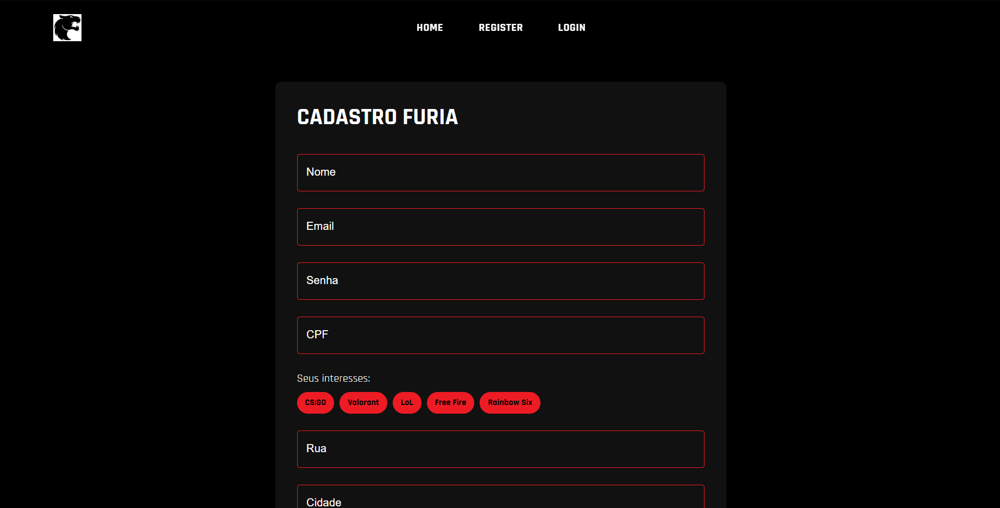
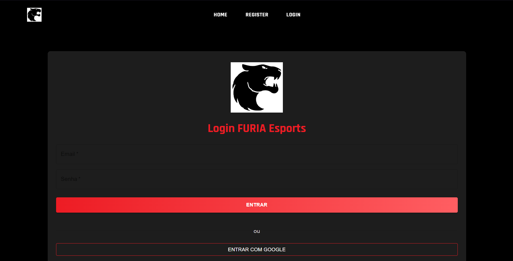
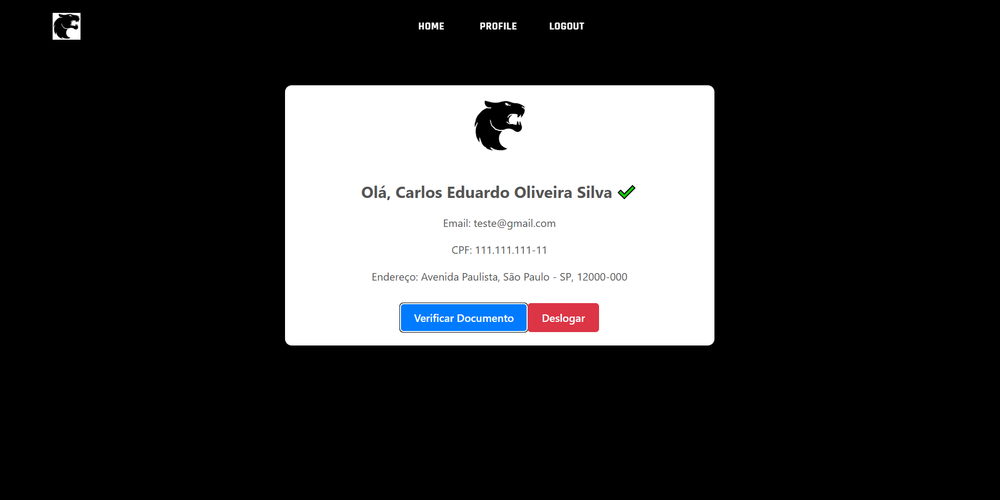

# KnowYourFan FURIA Esports

Esta é uma aplicação web sobre o **FURIA Esports**. A aplicação conta com notícias da Furia, além do cadastro de usuários e verificação de perfil.

## Tecnologias Utilizadas

| Camada          | Tecnologias                                 | 
|-----------------|---------------------------------------------|
| **Frontend**    | React 18, Vite 4, Axios, React Router 6     |
| **Backend**     | Spring Boot 3.1, JWT, Spring Security 6     |
| **Banco Dados** | MySQL 8                                     |
| **Autenticação**| Firebase Auth (Google)                      |
| **OCR**         | Tesseract 5.3                               |

##  Pré-requisitos

- Java JDK 17+
- Node.js 18+
- MySQL 8+
- Tesseract OCR ([Guia de Instalação](https://github.com/tesseract-ocr/tesseract))
- Conta Firebase ([Configuração](https://firebase.google.com/))

## 📱 Telas do Sistema

<div align="center" style="display: grid; grid-template-columns: repeat(2, 1fr); gap: 20px; margin: 30px 0;">

### 🏠 Hub Principal
  
*Homepage com notícias em destaque*

### 📝 Cadastro
  
*Formulário de cadastro de usuários*

### 🔑 Login
  
*Página de autenticação com opção social*

### 👤 Perfil
  
*Área do usuário com status de verificação*

</div>

## Como Acessar o Projeto

## Rodando localmente 

```bash
Clone o repositório: git clone https://github.com/caduoliveira01/Furia-ChatBot.git 
### Backend
```bash
cd backend
./mvnw spring-boot:run
# A API estará disponível em http://localhost:8080

###Frontend
cd frontend
npm install
npm run dev
# Acesse http://localhost:5173 no navegador
```

## Endpoints Principais 

### Autenticação (`/auth`)
| Método | Endpoint       | Descrição                | Request Body Example                 |
|--------|----------------|--------------------------|---------------------------------------|
| POST   | `/auth`        | Cria novo usuário        | `{ "email": "user@furia.com", "senha": "123", "nome": "Carlos Silva", ... }` |
| POST   | `/auth/login`  | Realiza login            | `{ "email": "user@furia.com", "senha": "123" }` |

### Documentos (`/api/documentos`)
| Método | Endpoint       | Descrição                     | Headers Obrigatórios         |
|--------|----------------|-------------------------------|------------------------------|
| POST   | `/upload`      | Envia documento para verificação | `Authorization: Bearer <JWT>`, `Content-Type: multipart/form-data` |
| GET    | `/`            | Lista documentos do usuário   | `Authorization: Bearer <JWT>` |

### Usuários (`/api/users`)
| Método | Endpoint       | Descrição                     | Exemplo de Response           |
|--------|----------------|-------------------------------|--------------------------------|
| GET    | `/me`          | Retorna dados do usuário      | `{ "nome": "Carlos", "verificado": true, ... }` |
| PUT    | `/{id}`        | Atualiza dados do usuário     | `{ "endereco": "Rua Furia, 123" }` |

---
## Desenvolvido por:
Carlos Oliveira

### 📌 Linkedin:
[Carlos Oliveira](https://www.linkedin.com/in/carlos-oliveira-338a04233/)
